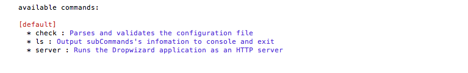
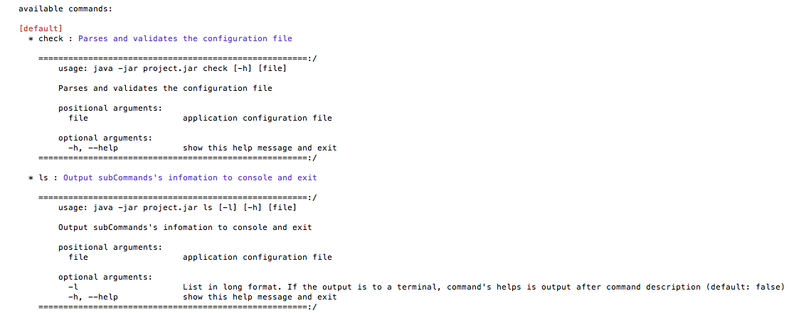

# dropwizard-ls-command
dropwizard-ls-command extends dropwizard's default cli and provides output like django

# Download
grab via Maven:  
```xml
    <repositories>
        <!-- your dependencies>
        <!-- ...-->
        <!-- dropwizard-ls-command's repository-->
        <repository>
            <id>kemsakurai.github.io</id>
            <url>https://kemsakurai.github.io/maven/master/releases</url>
            <releases>
                <enabled>true</enabled>
            </releases>
            <snapshots>
                <enabled>true</enabled>
            </snapshots>
        </repository>
    </repositories>
    <dependencies>
        <!-- your dependencies>
        <!-- ...-->
        <!-- dropwizard-ls-command -->
        <dependency>
            <groupId>xyz.monotalk.dropwizard</groupId>
            <artifactId>dropwizard-ls-command</artifactId>
            <version>0.0.2</version>
        </dependency>
    </dependencies>
```
or Gradle:

```gradle

    repositories {
          maven { url 'https://kemsakurai.github.io/maven/master/releases' }
    }

    compile 'dropwizard-ls-command:0.0.2'
    
```

# Usage
####1. Add LsCommand in the initialize stage of your application.

```    

        public void initialize(Bootstrap<Configuration> bootstrap) {
            bootstrap.addCommand(new LsCommand(this));
            // And your initialize process..
        }

```

####2. Compile your source code.


####3. Output commad list

* command

```Bash
java -jar target/xxx.jar ls
```

* output 



####4. Output commad list detail

* command

```Bash
java -jar target/xxx.jar ls -l
```
* output 




# License
```java
/*******************************************************************************
 * Copyright (C) 2015 Kem
 *
 * Licensed under the Apache License, Version 2.0 (the "License");
 * you may not use this file except in compliance with the License.
 * You may obtain a copy of the License at
 *
 *   http://www.apache.org/licenses/LICENSE-2.0
 *
 * Unless required by applicable law or agreed to in writing, software
 * distributed under the License is distributed on an "AS IS" BASIS,
 * WITHOUT WARRANTIES OR CONDITIONS OF ANY KIND, either express or implied.
 * See the License for the specific language governing permissions and
 * limitations under the License.
 ******************************************************************************/
```

